# Architecture

## 1. Overall request flow

Every http request passes through this layered pipeline before reaching a handler.

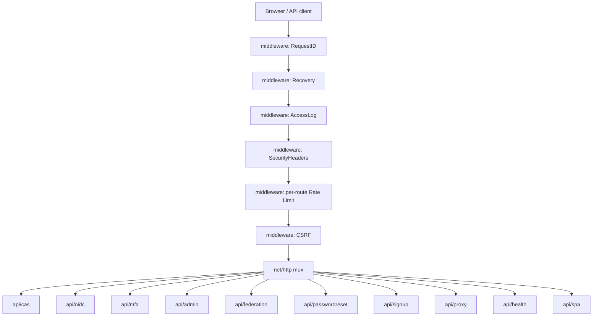

The middleware order is important.

`SecurityHeaders` runs before Rate limit and CSRF(Cross-Site Request Forgery) so its headers are present even on rate limit `429` responses.

CSRF runs after rate limit so a request is checked against the rate limit before hitting the CSRF validation.

---

---

## 2. Foundation packages

### internal/config

Central env loaded configuration. Read once when building, shared as a value.

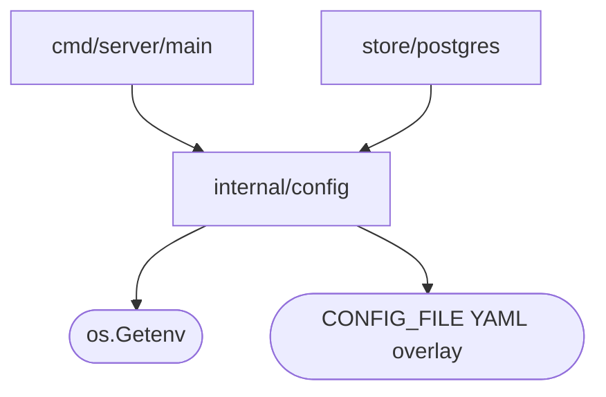

**Env vars**, every env var the server reads passes through here:

| Variable                         | Purpose                                                                                         |
| -------------------------------- | ----------------------------------------------------------------------------------------------- |
| `BASE_URL`                       | Public URL. Used for OIDC issuer, `WebAuthn` RPID, redirect uri matching.                       |
| `DATABASE_URL`                   | Postgres connection string.                                                                     |
| `SESSION_SECRET`                 | 32-byte hex secret for HMAC-signing session cookies.                                            |
| `SIGNING_KEY_PATH`               | Path to signing.pem (single key mode) OR a directory of \*.pem files (multi-key rotation mode). |
| `HTTP_ADDR`                      | Listen address (default `:8080`).                                                               |
| `ENV`                            | `dev` or `production`. Affects cookie Secure flag and log defaults.                             |
| `LOG_LEVEL`                      | `debug`, `info`, `warn`, `error`.                                                               |
| `LOG_FORMAT`                     | `text` (default in dev) or `json` (production).                                                 |
| `AUTO_MIGRATE`                   | When `true`, apply pending migrations on build.                                                 |
| `CONFIG_FILE`                    | Optional path to a YAML overlay (non-secret fields).                                            |
| `TRUSTED_PROXIES`                | CIDR basically range of ip addresses allowlist for X-Forwarded-For honouring.                   |
| `SESSION_COOKIE_DOMAIN`          | Optional explicit Domain attribute on session cookie.                                           |
| `PROXY_ALLOWED_CALLBACK_ORIGINS` | Allowlisted cross-origin `rd=` callbacks for the proxy companion.                               |

### internal/store/postgres

The only place queries called is here. All other packages call typed. You can read more about it [store-docs](./store/README.md)

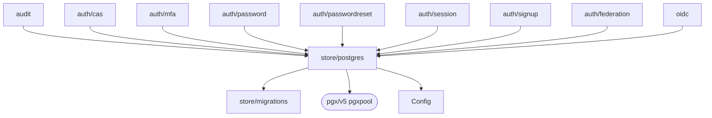

**Env vars used**: `DATABASE_URL`, `AUTO_MIGRATE`.

### internal/crypto

Cryptographic primitives

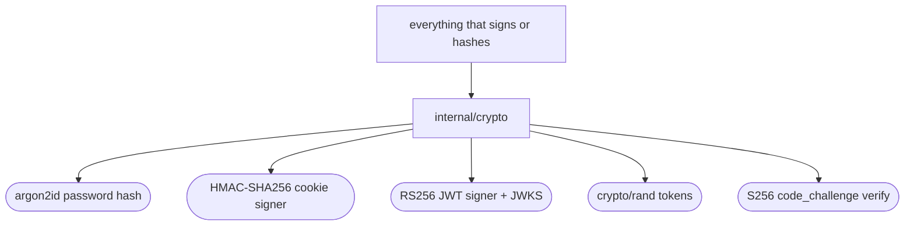

**Env vars used**: `SIGNING_KEY_PATH`, `SESSION_SECRET`.

### internal/email

Email sender. The `Sender` interface has two implementations

- normal smtp
- noop, for development, basically logs the links that should be in the email through the logger

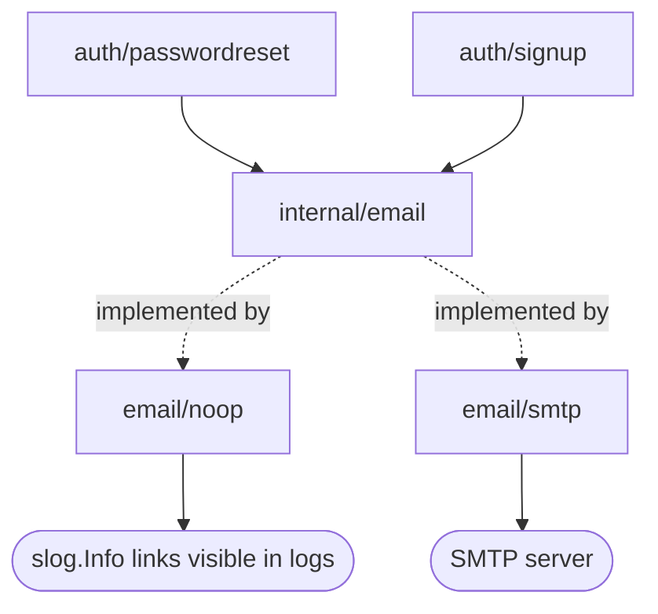

**Env vars used**, empty `SMTP_HOST` selects the noop sender:

| Variable        | Purpose                                                |
| --------------- | ------------------------------------------------------ |
| `SMTP_HOST`     | SMTP server hostname. Empty = noop sender.             |
| `SMTP_PORT`     | Default 587 (STARTTLS) or 465 (implicit TLS).          |
| `SMTP_USERNAME` | Auth username.                                         |
| `SMTP_PASSWORD` | Auth secret. Env-only, never YAML.                     |
| `SMTP_FROM`     | Display From header, ex `IAM <noreply@lusopoint.com>`. |

### internal/audit

Append only event log. Every security relevant action passes through here.

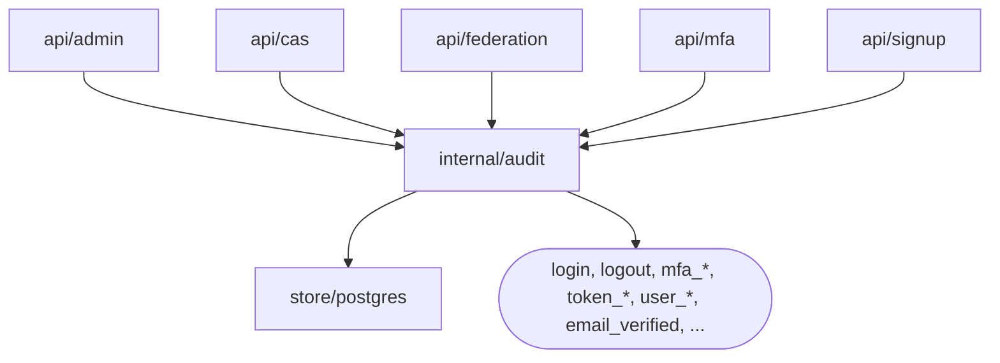

**Env vars used**: none (writes to db).

### internal/middleware

Http protection:

- Route limiting
- CSRF
- SecurityHeaders
- Logs the proper errors (Recovery)

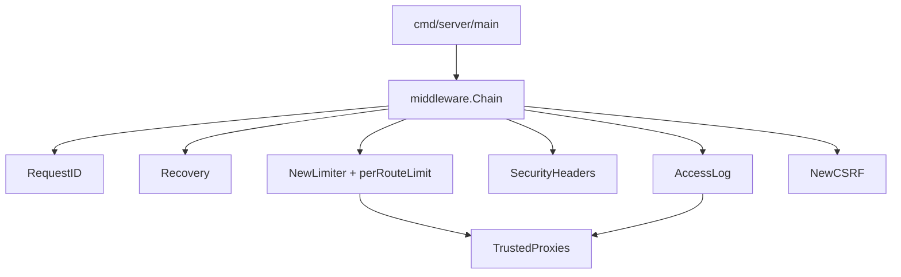

**Env vars used**: `TRUSTED_PROXIES` (parsed once and shared with rate limiter + access log).

---

---

## 3. Auth services (business policy)

These hold the rules, what's a valid session, what's a valid MFA challenge and what counts as a weak password.

### internal/auth/session

Browser session management. cookies + db backed session rows.

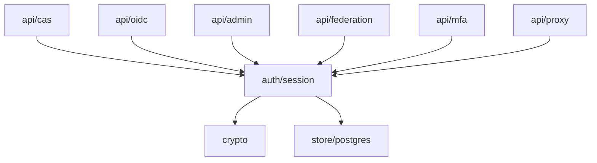

**Env vars used**: `SESSION_SECRET`, `SESSION_COOKIE_DOMAIN`, `BASE_URL`

### internal/auth/password

Password verification. Argon2id + failed attempt tracking.

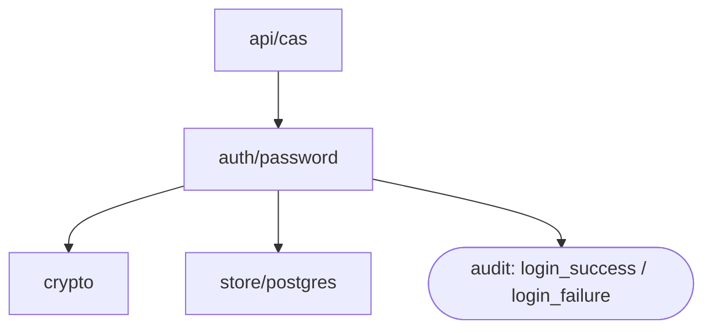

**Env vars used**: none directly. Argon2 params (time=3, memory=64MB, threads=4) are baked in the code (maybe in the future we could change that)

### internal/auth/mfa

TOTP, WebAuthn, backup codes. Includes the force MFA global policy gate.

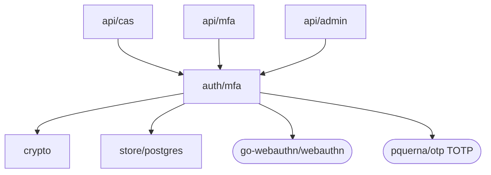

**Env vars used**:

| Variable               | Purpose                                                       |
| ---------------------- | ------------------------------------------------------------- |
| `MFA_ISSUER`           | TOTP issuer label (basically shows on authentication app).    |
| `MFA_WEBAUTHN_RP_NAME` | Human readable RP name shown in passkey prompts.              |
| `FORCE_MFA`            | When true, every user must enrol MFA before completing login. |

WebAuthn RPID is derived from `BASE_URL` (no env var).

### internal/auth/cas

CAS service-ticket lifecycle. Issue, validate, expire.

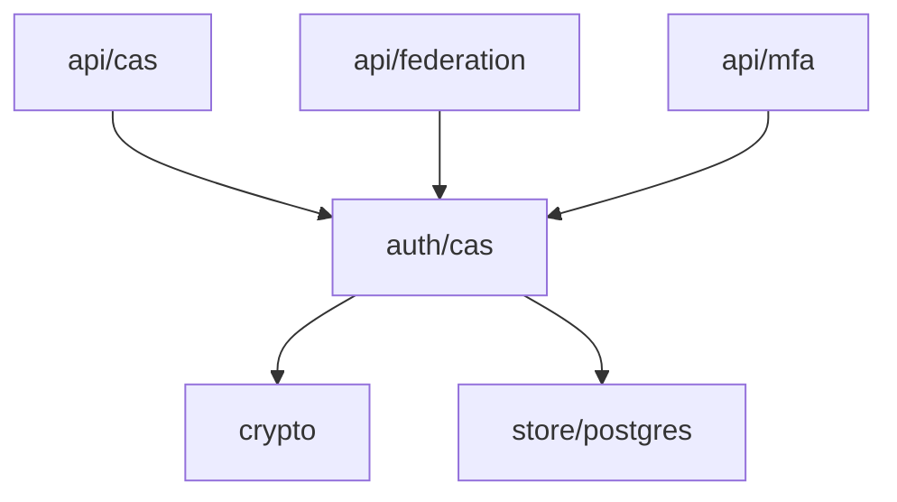

**Env vars used**: none directly (cookie security derived from `BASE_URL`).

### internal/auth/passwordreset

Forgot password flow. Token insurance, verification, password change.

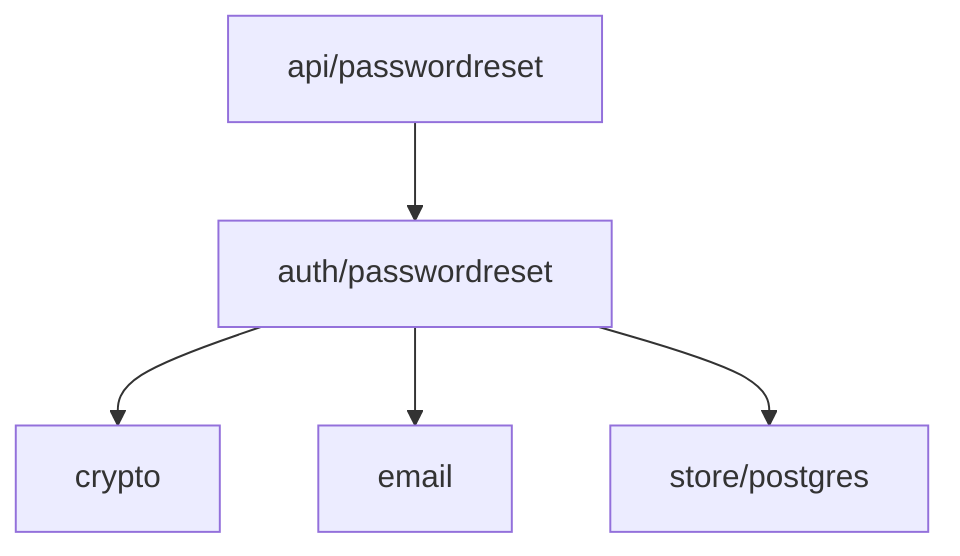

**Env vars used**: none directly, using `BASE_URL`, `SMTP_*` via the email and store/config layers. No reset specific env vars.

### internal/auth/signup

Registration + email verification. Similar to passwordreset.

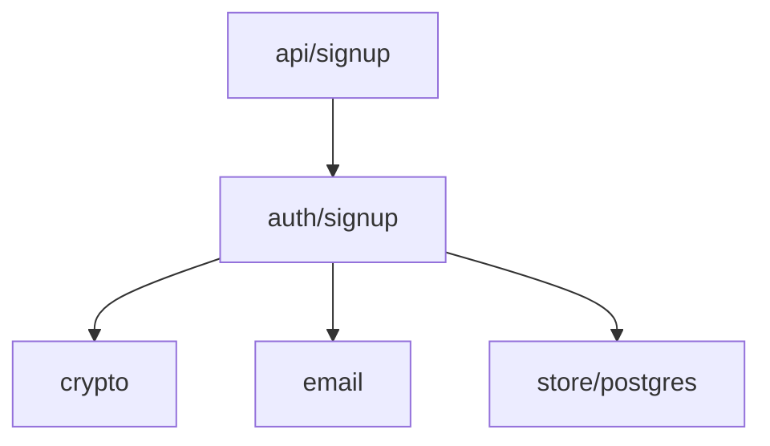

**Env vars used**:

| Variable                     | Purpose                                                                      |
| ---------------------------- | ---------------------------------------------------------------------------- |
| `SIGNUP_ENABLED`             | Default false. When false the entire flow is unwired: `/signup` returns 404. |
| `SIGNUP_MIN_PASSWORD_LENGTH` | Floor for chosen passwords (default 12).                                     |
| `SIGNUP_TOKEN_TTL_HOURS`     | Verification-link lifetime (default 24).                                     |

### internal/auth/federation

Service that connects provides (`internal/federation/*`) to our db.

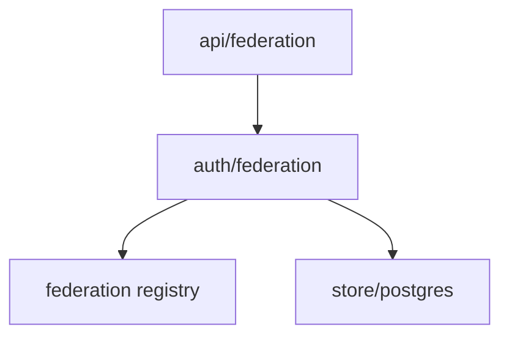

**Env vars used**: none directly. Provider configs are read by `internal/federation/*`.

---

---

## 4. Federation providers

Each provider implements the same interface. Configured by env, registered at boot.

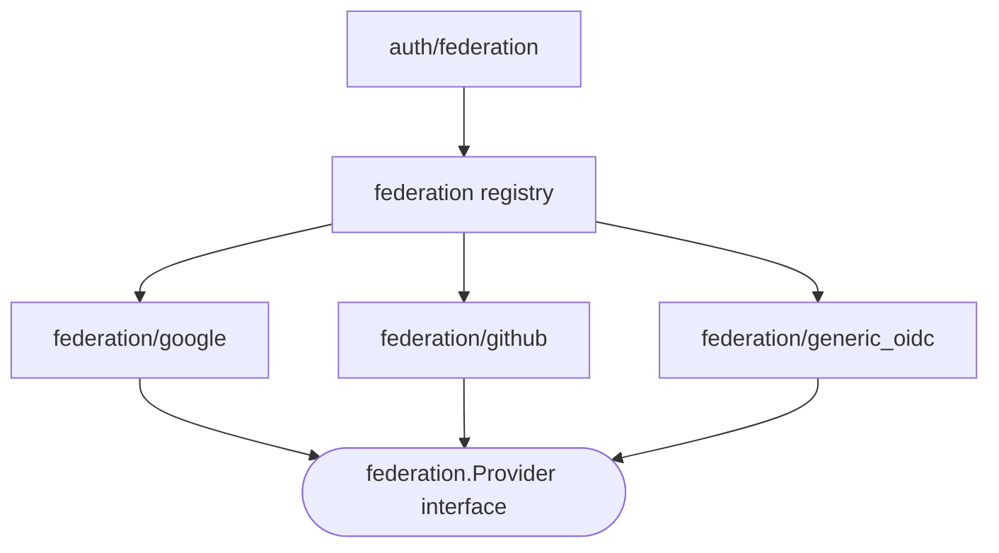

**Env vars used**:

| Variable                    | Purpose                                                               |
| --------------------------- | --------------------------------------------------------------------- |
| `GOOGLE_CLIENT_ID`          | Enables the Google button.                                            |
| `GOOGLE_CLIENT_SECRET`      | Google OAuth 2 client secret.                                         |
| `GITHUB_CLIENT_ID`          | Enables the GitHub button.                                            |
| `GITHUB_CLIENT_SECRET`      | GitHub OAuth 2 client secret.                                         |
| `OIDC_PROVIDERS`            | Comma-separated slugs for additional OIDC IdPs, e.g. `okta,keycloak`. |
| `OIDC_<SLUG>_ISSUER`        | Discovery url for each slug.                                          |
| `OIDC_<SLUG>_CLIENT_ID`     | OIDC client ID.                                                       |
| `OIDC_<SLUG>_CLIENT_SECRET` | OIDC client secret.                                                   |
| `OIDC_<SLUG>_SCOPES`        | Optional scope override (default `openid email profile`).             |
| `OIDC_<SLUG>_DISPLAY_NAME`  | Optional button label override.                                       |

Reserved slugs (`google`, `github`) cannot be used as generic OIDC slugs.

---

---

## 5. OIDC logic

`internal/oidc` is the protocol layer logic (token issuance, code exchange, claim assembly). Distinct from `internal/api/oidc` which is just the http handler and this one is the service.

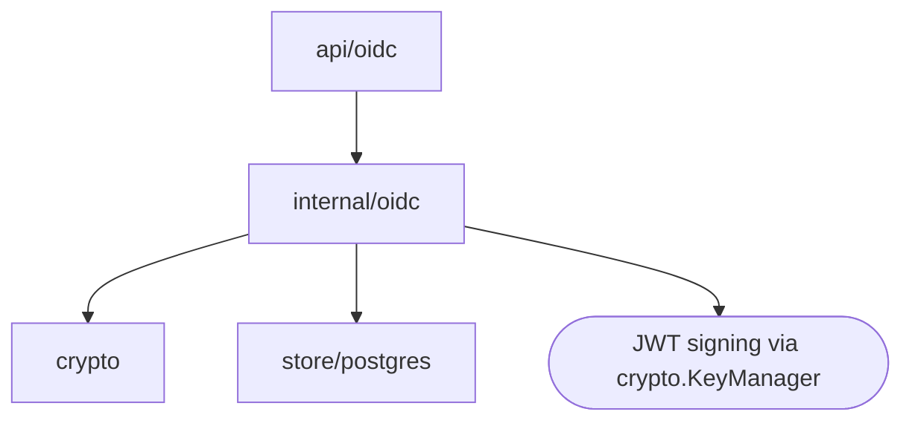

**Env vars used (indirectly via config)**: `BASE_URL` (issuer), `SIGNING_KEY_PATH` (used by KeyManager).

---

---

## 6. HTTP layer (api/\*)

Each `api/*` package owns a route and translates http into calls on the auth/services above.

### internal/api/cas

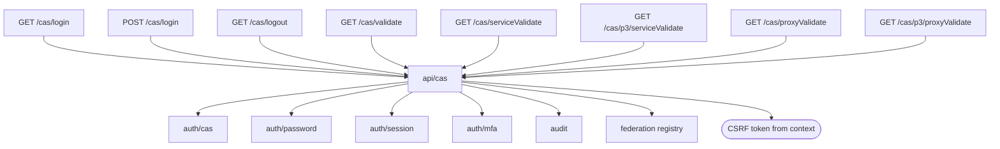

**Env vars relevant**:

| Variable                         | Purpose                                                          |
| -------------------------------- | ---------------------------------------------------------------- |
| `PROXY_ALLOWED_CALLBACK_ORIGINS` | Allowlist for `?rd=` cross-origin redirects.                     |
| `SIGNUP_ENABLED`                 | Controls whether the login page renders a "Create account" link. |
| `MFA_*`, `FORCE_MFA`             | Determine the MFA challenge / enrollment branch in login.        |

### internal/api/oidc

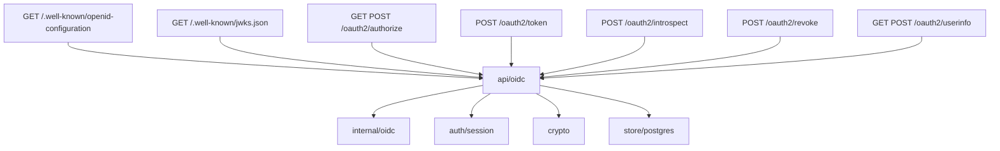

**Env vars relevant**: `BASE_URL` (issuer), `SIGNING_KEY_PATH`.

Rate limit: `/oauth2/token` is keyed on `client_id` (Basic auth -> form -> IP fallback), 20/min default.

### internal/api/mfa

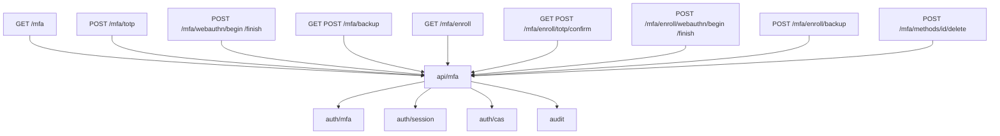

**Env vars relevant**: `MFA_ISSUER`, `MFA_WEBAUTHN_RP_NAME`, `FORCE_MFA`.

### internal/api/admin

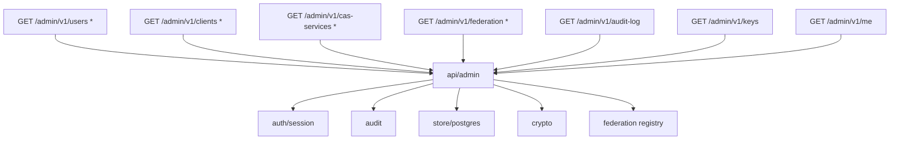

**Env vars relevant**: none specific to admin; auth gating comes via `auth/session`.

### internal/api/federation

```mermaid
flowchart TD
  R1[GET /oauth/authorize/provider] --> ApiFed
  R2[GET /oauth/callback/provider] --> ApiFed
  ApiFed[api/federation] --> AuthFed[auth/federation]
  ApiFed --> AuthCas[auth/cas]
  ApiFed --> Mfa[auth/mfa]
  ApiFed --> Session[auth/session]
  ApiFed --> Crypto[crypto]
  ApiFed --> Federation[federation registry]
  ApiFed --> Audit[audit]
```

**Env vars relevant**: `GOOGLE_*`, `GITHUB_*`, `OIDC_PROVIDERS` + per-slug vars.

### internal/api/passwordreset

```mermaid
flowchart TD
  R1[GET /password/forgot] --> ApiPR
  R2[POST /password/forgot] --> ApiPR
  R3[GET /password/reset] --> ApiPR
  R4[POST /password/reset] --> ApiPR
  ApiPR[api/passwordreset] --> PrSvc[auth/passwordreset]
  ApiPR --> Middleware([CSRF token from context])
```

**Env vars relevant**: `BASE_URL`, `SMTP_*`.

Rate limit: 5/min/IP shared with login (separate `forgot:` and `reset:` key prefixes).

### internal/api/signup

```mermaid
flowchart TD
  R1[GET /signup] --> ApiSignup
  R2[POST /signup] --> ApiSignup
  R3[GET /verify] --> ApiSignup
  ApiSignup[api/signup] --> SignupSvc[auth/signup]
  ApiSignup --> Audit[audit]
  ApiSignup --> Middleware([CSRF token from context])
```

**Env vars relevant**: `SIGNUP_ENABLED`, `SIGNUP_MIN_PASSWORD_LENGTH`, `SIGNUP_TOKEN_TTL_HOURS`, `SMTP_*`, `BASE_URL`.

When `SIGNUP_ENABLED=false`, the routes are not registered at all.

### internal/api/proxy

Reverse proxy companion.

```mermaid
flowchart TD
  R1[GET /proxy/verify] --> ApiProxy
  ApiProxy[api/proxy] --> Session[auth/session]
  ApiProxy --> Store[store/postgres]
  ApiProxy --> Headers([sets X-Auth-User, X-Auth-Email, X-Auth-Groups on 200])
  ApiProxy --> Location([sets Location on 401 if rd= in allowlist])
```

**Env vars relevant**: `PROXY_ALLOWED_CALLBACK_ORIGINS`.

CSRF: exempt (read-only endpoint, no state change).

### internal/api/health

```mermaid
flowchart TD
  R1[GET /healthz] --> ApiHealth
  R2[GET /readyz] --> ApiHealth
  ApiHealth[api/health] --> Store[store/postgres]
```

**Env vars relevant**: none. `/healthz` is unconditional; `/readyz` pings the db pool.

CSRF: exempt (read-only; load-balancer probes shouldn't accumulate state cookies).

### internal/api/spa (TODO: this will probably change)

Serves the embedded React admin UI.

```mermaid
flowchart TD
  R1[GET /admin] --> ApiSpa
  R2[GET /admin/*] --> ApiSpa
  ApiSpa[api/spa] --> Embed([go:embed web/dist])
```

---

## 7. Where the env vars actually come from

Putting it all together, a single env var typically flows through `config` to one or two services:

```mermaid
flowchart LR
  Env([Environment variables]) --> Config
  Config[internal/config] --> AuthMfa[auth/mfa]
  Config --> AuthSignup[auth/signup]
  Config --> AuthPR[auth/passwordreset]
  Config --> AuthSession[auth/session]
  Config --> Store[store/postgres]
  Config --> Crypto[crypto KeyManager]
  Config --> EmailFactory[email factory in main]
  Config --> Federation[federation registry]
  Config --> Middleware[middleware setup in main]
  EmailFactory -.selects.-> Noop[email/noop]
  EmailFactory -.or.-> Smtp[email/smtp]
```

The complete env variable reference lives in:

- `internal/config/config.go`, authoritative; if these two diverge the code wins
