# Database schema

## TLDR — what's in here

| Table                       | What it stores                                           | Cleanup                                     |
| --------------------------- | -------------------------------------------------------- | ------------------------------------------- |
| `users`                     | Canonical user record (one row per person).              | Soft delete (`deleted_at`).                 |
| `user_credentials`          | Argon2id password hash, one per user.                    | Cascade with user.                          |
| `user_identities`           | Federation links — Google/GitHub/etc. sub → local user.  | Cascade with user.                          |
| `user_mfa_methods`          | TOTP secrets + WebAuthn credentials.                     | Cascade with user.                          |
| `user_backup_codes`         | Single-use recovery codes (hashed).                      | Cascade with user; row stays after use.     |
| `sessions`                  | Browser sessions; doubles as CAS Ticket-Granting Ticket. | Sliding expiry + revoked_at.                |
| `cas_services`              | Registered CAS service URL patterns.                     | Soft delete.                                |
| `cas_tickets`               | Ephemeral CAS service tickets (~60s).                    | Consumed-once; expire fast.                 |
| `oidc_clients`              | Registered OIDC/OAuth2 client apps.                      | Soft delete.                                |
| `oidc_auth_codes`           | Authorization codes (≤10 min).                           | Consumed-once.                              |
| `oidc_access_tokens`        | Opaque bearer tokens.                                    | Expires + revoke.                           |
| `oidc_refresh_tokens`       | Refresh tokens (with rotation chain).                    | Rotated or revoked.                         |
| `password_reset_tokens`     | Hashed forgot-password tokens (~30 min).                 | Consumed-once.                              |
| `email_verification_tokens` | Hashed signup-verification tokens (~24h).                | Consumed-once.                              |
| `audit_log`                 | Append-only event log.                                   | Never modified; pruning is operator policy. |

## Master ERD — all tables, all relationships

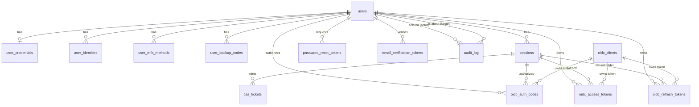

`cas_services` and `audit_log` are also present but they're either standalone (`cas_services`) or one-to-many from `users` only (`audit_log`). Showing every edge would clutter the diagram. They appear in their per-table sections below.

## Conventions used everywhere

- **Primary keys**: UUID via the `uuid()` plpgsql helper (defined in 0001). Time-sortable, index-friendly. Token tables use `TEXT` PKs because the value IS the token.
- **Timestamps**: `TIMESTAMPTZ`, UTC, `DEFAULT now()`.
- **Soft deletes**: a `deleted_at TIMESTAMPTZ NULL` column where applicable. Partial indexes (`WHERE deleted_at IS NULL`) keep the hot path fast.
- **Email column**: `citext` everywhere it appears — case-insensitive comparison without `lower()` everywhere.
- **`touch_updated_at` trigger**: every table with an `updated_at` column has a `BEFORE UPDATE` trigger that bumps it.
- **JSONB**: used wherever payload shape can vary without a schema migration (audit `metadata`, federation `raw_claims`, MFA `credential`).

---

## Core identity

### `users`

The canonical user record. Everything else hangs off `users.id`.

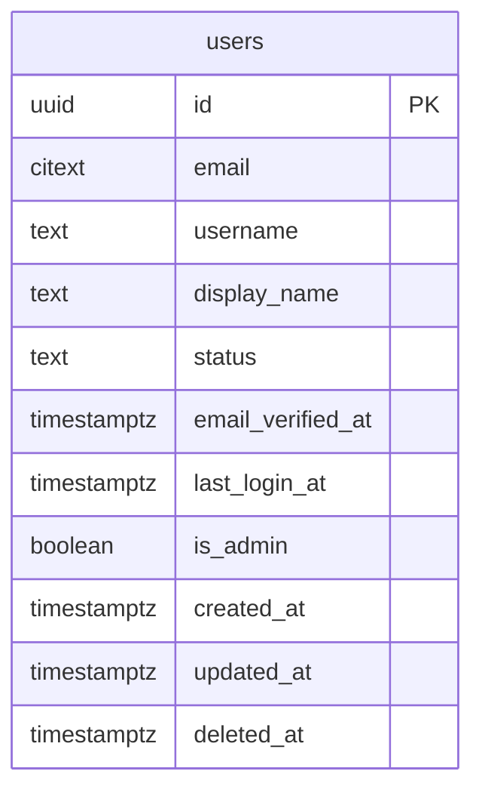

Status is one of `active`, `locked`, `disabled` (CHECK constraint enforces this). `email_verified_at` is `NULL` until the user clicks the verification link (or until an admin sets it manually). `is_admin` was added in 0007 — promotion is intentionally manual.

Unique indexes are partial: `(email)` and `(username)` are unique only among non-deleted rows, so the same address can be reused after a hard-delete.

### `user_credentials`

One row per user with their argon2id password hash. Separate from `users` so federation-only accounts don't have a half-populated row.

```mermaid
erDiagram
    users ||--o| user_credentials : has
    user_credentials {
        uuid user_id PK_FK
        text password_hash
        timestamptz password_changed_at
        boolean must_change
        integer failed_attempts
        timestamptz locked_until
        timestamptz created_at
        timestamptz updated_at
    }
```

`failed_attempts` and `locked_until` exist for future brute-force lockout — currently rate-limiting is the only defence. `password_hash` is the full PHC-format string (`$argon2id$v=19$m=65536,t=3,p=4$...$...`) so the parameters travel with the hash and we can upgrade them later.

### `user_identities`

Federation links. One row per `(provider, sub)` pair — Alice's Google account is one row, her GitHub account is another, both pointing at the same `user_id`.

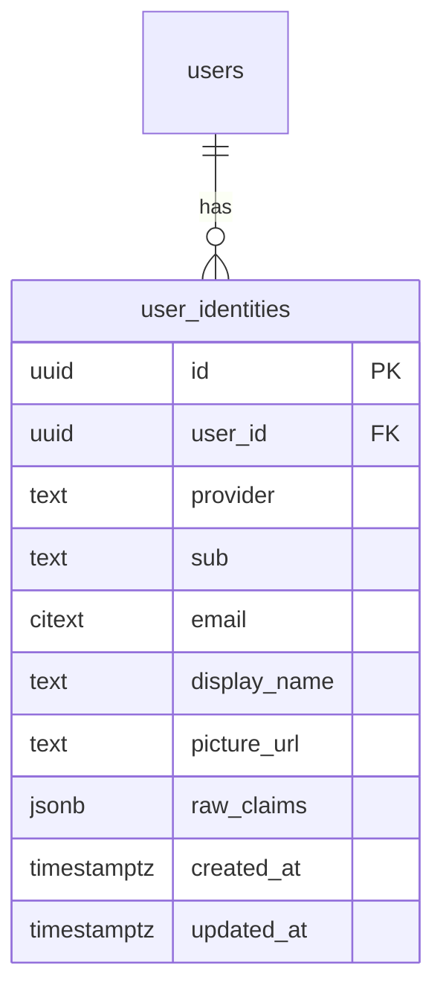

`(provider, sub)` is unique — one provider account links to exactly one IAM user. `raw_claims` is the full token payload from the last login, kept for audit and future attribute-release without re-fetching. `email` here is cached from the provider; it is NOT authoritative (do not authorize against it).

### `user_mfa_methods`

Enrolled second factors. The `method` column drives which payload columns are read.

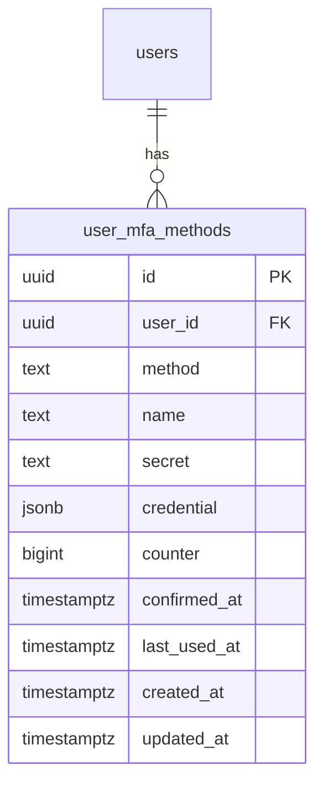

`method` is `'totp'` or `'webauthn'` (CHECK constraint). For TOTP the `secret` column holds the base32 shared secret. For WebAuthn the `credential` JSONB holds the serialized go-webauthn credential and `counter` tracks the FIDO sign-count (clone detection). A row is only usable once `confirmed_at` is set — issued-but-unconfirmed enrollments are pending.

### `user_backup_codes`

Single-use MFA recovery codes. Each row is the argon2id hash of one code; plaintext is shown to the user once at generation and never persisted.

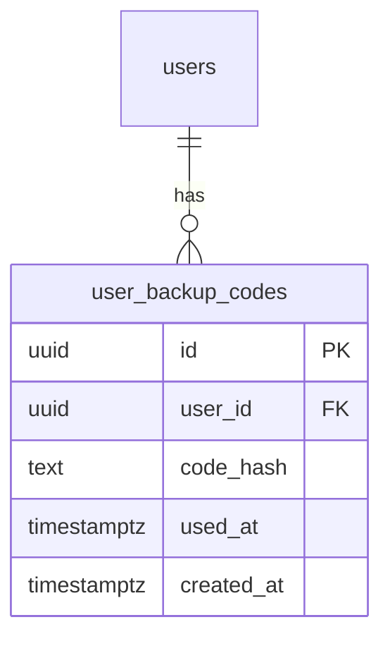

Regenerating a user's codes is atomic: delete the old set, insert the new set, all in one transaction. Used codes stay in the table (with `used_at` set) so the audit log can reference them.

---

## Session state

### `sessions`

Browser sessions. The session ID lives in an HMAC-signed cookie; this row holds the actual state. Doubles as the CAS Ticket-Granting Ticket — service tickets and OIDC tokens are bound to a `session_id`.

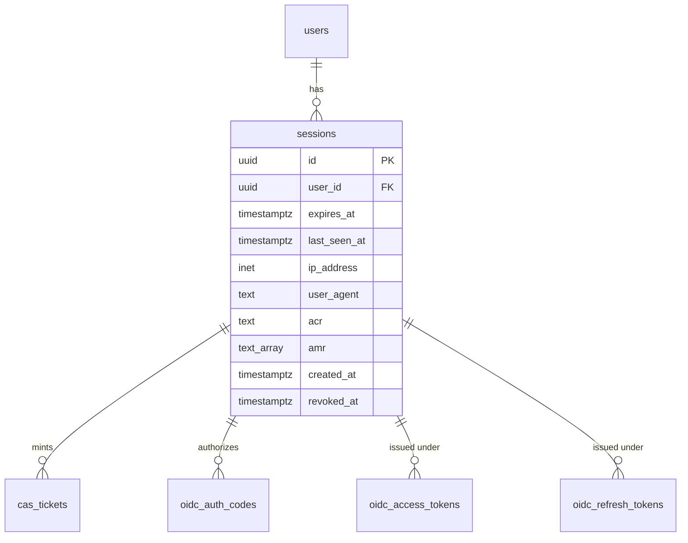

Two expiry knobs: `expires_at` is the absolute ceiling, `last_seen_at` is the sliding anchor (bumped on every authenticated request). The `acr` + `amr` columns (added in 0006) carry the authentication context onto OIDC id_tokens — `acr='1'` means MFA was satisfied, `amr` lists the factors used.

---

## CAS

### `cas_services`

Registered CAS service URL patterns. The login flow validates the `service` query parameter against this table.

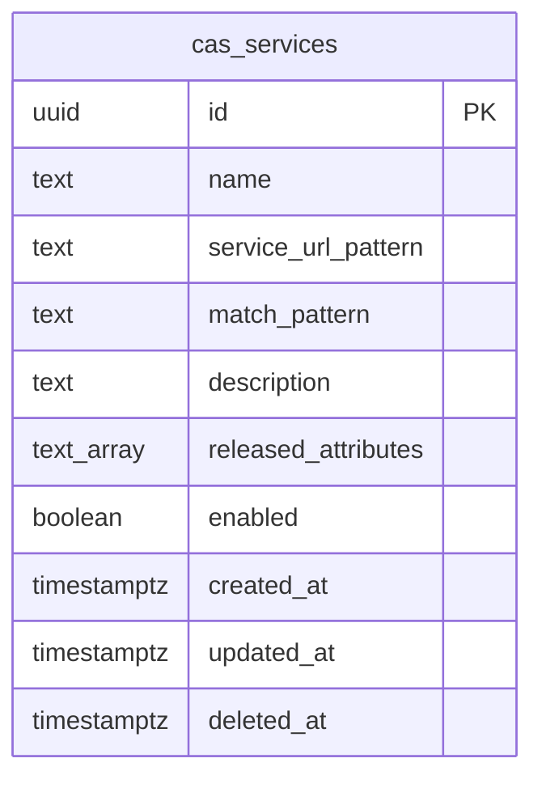

Matching uses SQL `LIKE`. The operator writes a human-readable pattern (`https://app.example.com/*`); the application stores the SQL-LIKE form (`https://app.example.com/%`) in `match_pattern` at write time so lookups are a single indexed predicate. `released_attributes` controls which user fields are released in CAS 3.0 / SAML 1.1 validation responses; empty means username only.

### `cas_tickets`

Ephemeral CAS service tickets issued by `/cas/login` and consumed by `/cas/serviceValidate`. Single-use, ~60-second TTL.

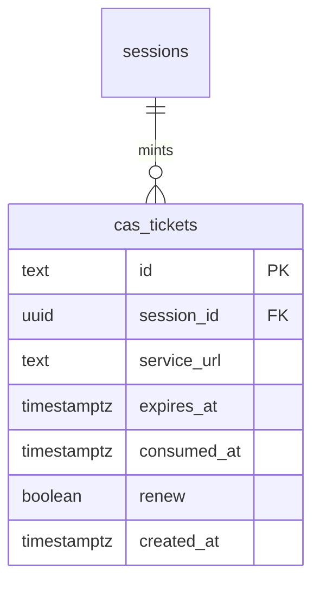

The ticket itself is the primary key (server-generated random string with the `ST-` prefix required by the CAS spec). When the relying app calls validate, the row is read, `consumed_at` is set, and a second use returns failure. Cascade-delete with sessions: revoking the session kills any pending tickets too.

---

## OIDC

### `oidc_clients`

Registered OAuth 2.0 / OIDC client applications.

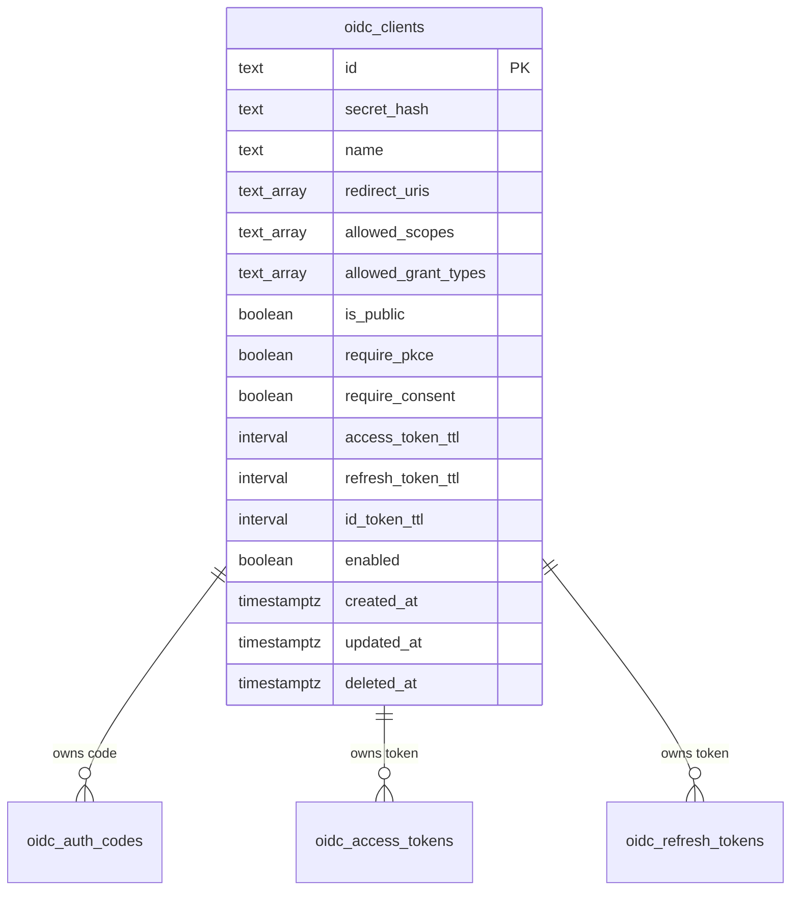

`id` is the client_id (short string, human-friendly when possible). `secret_hash` is argon2id; NULL for public clients. `redirect_uris` is an exact-match allowlist — wildcards are NOT allowed per spec. Per-client TTL overrides server defaults. Public clients ALWAYS require PKCE regardless of the flag.

### `oidc_auth_codes`

Short-lived authorization codes (≤10 min). Consumed once by the token endpoint.

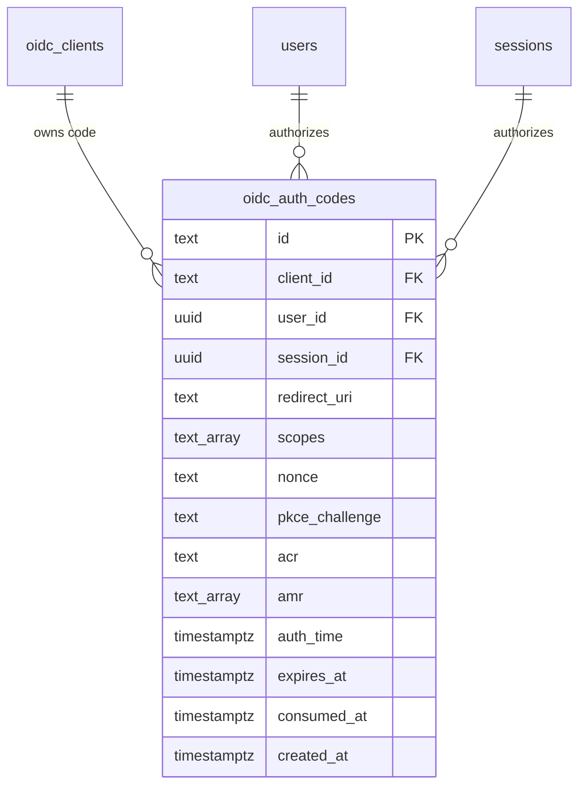

Format: `code_<32 hex chars>`. The `pkce_challenge` is the S256-hashed challenge stored at issue time; the verifier is checked at exchange. `acr`/`amr`/`auth_time` capture the authentication context at issue, so they can be reflected back into the id_token even if the session changed by the time the code is exchanged.

### `oidc_access_tokens`

Opaque bearer tokens. `/oauth2/introspect` and `/oauth2/userinfo` look up by token id.

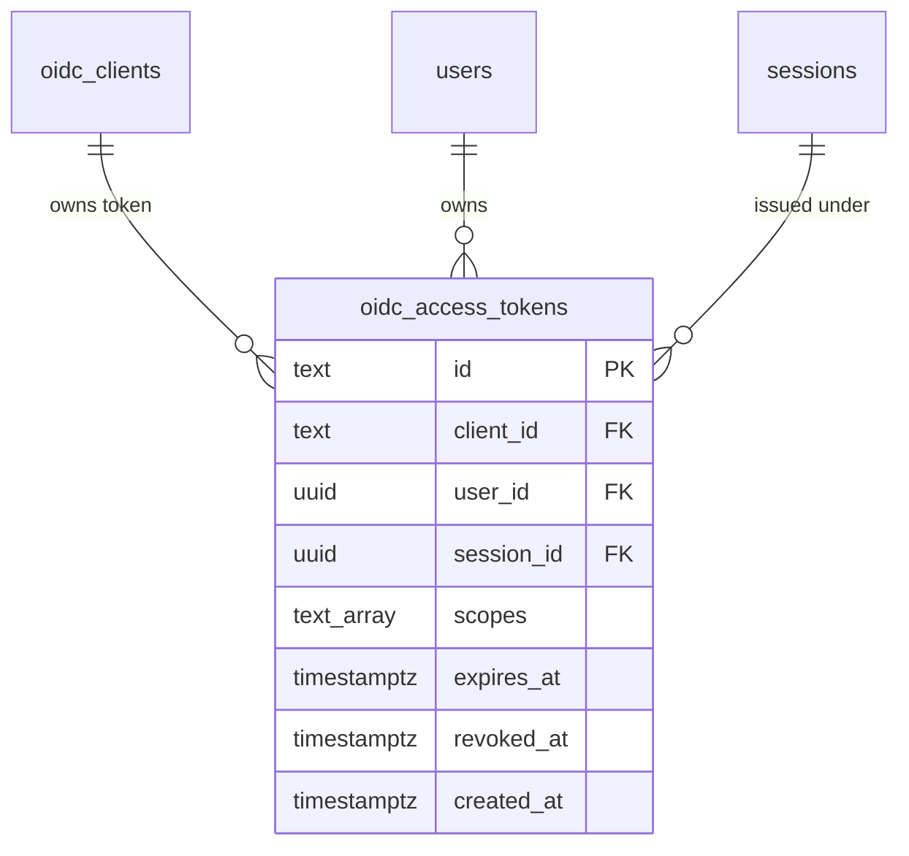

Format: `at_<32 hex chars>`. `user_id` is NULL for the client_credentials grant (no user, just an app calling on its own behalf). `session_id` is `ON DELETE SET NULL` — revoking a session doesn't kill outstanding access tokens, but introspection can join back to see they're orphaned.

### `oidc_refresh_tokens`

Long-lived tokens redeemed for new access tokens. Rotation chain: each use consumes the current token (`rotated_at`) and issues a new one whose `previous_id` points back.

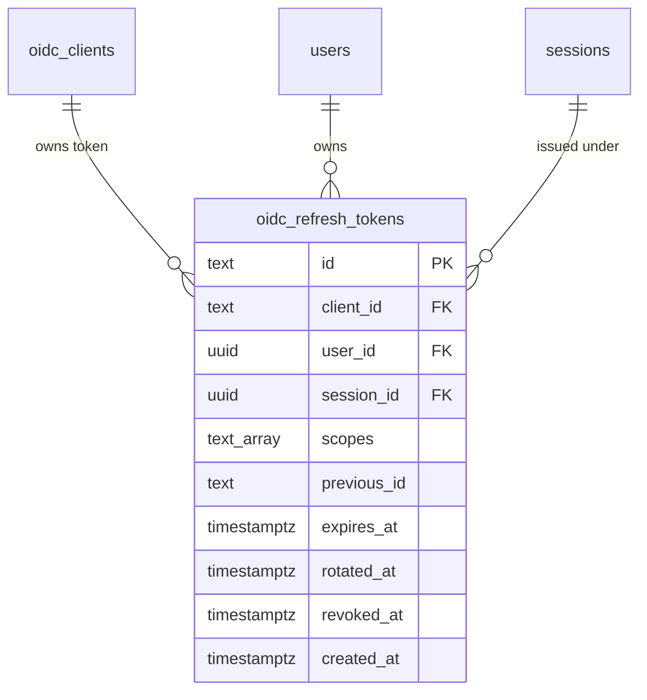

Format: `rt_<32 hex chars>`. Reuse of a rotated token (i.e. `rotated_at IS NOT NULL` on lookup) means the chain has been compromised — service code revokes the entire family.

---

## Self-service flows

### `password_reset_tokens`

Forgot-password tokens. Plaintext goes to the user's inbox; only `sha256(token)` is stored.

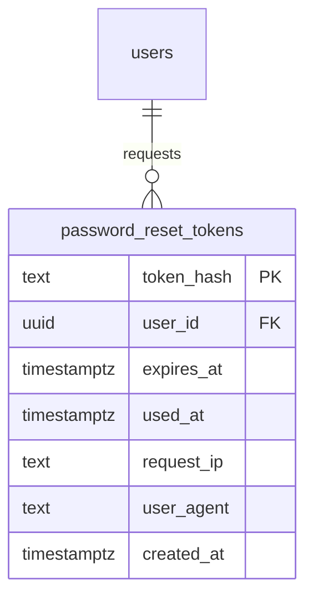

`token_hash` is the primary key, so a lookup is one indexed read on the only piece of data the server ever sees. Default TTL 30 minutes (enforced application-side). Single-use: `used_at` is set on consumption.

### `email_verification_tokens`

Signup-verification tokens. Symmetric to password reset, with two differences: longer TTL (~24h) and the verified email is snapshotted at issue time.

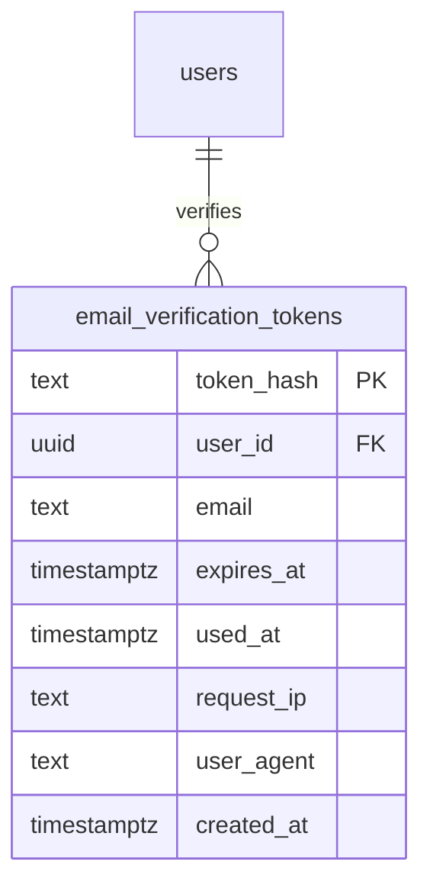

The `email` column captures the address being verified. If the user changes their email between issue and click, the token is still valid for the OLD address — the service code checks that the snapshot still matches the user's current email and refuses otherwise. This avoids accidentally verifying a new address with a token meant for the old one.

---

## Observability

### `audit_log`

Append-only event log. Every security-relevant action gets a row.

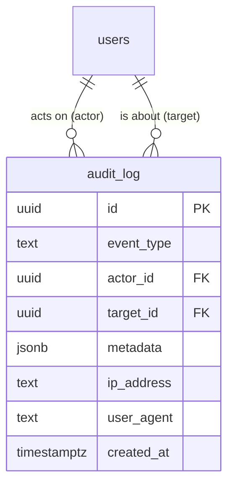

Two user references with different meanings: `actor_id` is who CAUSED the event (an admin doing the action, or the subject themselves), `target_id` is who the event is ABOUT (different from actor when an admin acts on someone else). Both are `ON DELETE SET NULL` so user deletion doesn't lose history. `metadata` is JSONB so each event type can carry its own shape without schema migrations.

Event types emitted today (from `internal/audit/service.go`): `login_success`, `login_failure`, `logout`, `mfa_enrolled`, `mfa_challenge_success`, `mfa_challenge_failure`, `password_changed`, `password_reset_requested`, `password_reset_completed`, `user_created`, `user_updated`, `user_deleted`, `user_locked`, `user_unlocked`, `email_verified`, `client_created`, `client_updated`, `client_deleted`, `client_secret_rotated`, `cas_service_created`, `cas_service_updated`, `cas_service_deleted`, `federation_linked`, `federation_unlinked`, `admin_action`.

Indexes are tuned for the common access patterns: reverse-chronological listing, filter by type, filter by actor, filter by target.

---

## Migration order (for fresh installs)

| #    | File                                   | What it adds                                                                               |
| ---- | -------------------------------------- | ------------------------------------------------------------------------------------------ |
| 0001 | `0001_init.up.sql`                     | Extensions (`pgcrypto`, `citext`), helpers (`uuid()`, `touch_updated_at()`), `users` table |
| 0002 | `0002_credentials_and_sessions.up.sql` | `user_credentials`, `sessions`                                                             |
| 0003 | `0003_cas.up.sql`                      | `cas_services`, `cas_tickets`                                                              |
| 0004 | `0004_federation.up.sql`               | `user_identities`                                                                          |
| 0005 | `0005_oidc.up.sql`                     | `oidc_clients`, `oidc_auth_codes`, `oidc_access_tokens`, `oidc_refresh_tokens`             |
| 0006 | `0006_mfa.up.sql`                      | `user_mfa_methods`, `user_backup_codes`; adds `acr`/`amr` to `sessions`                    |
| 0007 | `0007_admin_audit.up.sql`              | Adds `is_admin` to `users`; creates `audit_log`                                            |
| 0008 | `0008_password_reset.up.sql`           | `password_reset_tokens`                                                                    |
| 0009 | `0009_email_verification.up.sql`       | `email_verification_tokens`                                                                |

`AUTO_MIGRATE=true` applies anything pending on boot. For production rollbacks, prefer `make migrate-up` / `make migrate-down` instead.
