# Database schema

## TLDR — what is in here

| Table                       | What it stores                                                   | Cleanup                                     |
| --------------------------- | ---------------------------------------------------------------- | ------------------------------------------- |
| `users`                     | Canonical user record (one row per person).                      | Soft delete (`deleted_at`).                 |
| `user_credentials`          | Argon2id password hash, one per user.                            | Cascade with user.                          |
| `user_identities`           | Federation links. Google/GitHub/etc. sub maps to the local user. | Cascade with user.                          |
| `user_mfa_methods`          | TOTP secrets and WebAuthn credentials.                           | Cascade with user.                          |
| `user_backup_codes`         | Single-use recovery codes (hashed).                              | Cascade with user. Row stays after use.     |
| `sessions`                  | Browser sessions. Also the CAS Ticket-Granting Ticket.           | Sliding expiry plus revoked_at.             |
| `cas_services`              | Registered CAS service URL patterns.                             | Soft delete.                                |
| `cas_tickets`               | Ephemeral CAS service tickets (~60s).                            | Consumed-once. Expire fast.                 |
| `oidc_clients`              | Registered OIDC/OAuth2 client apps.                              | Soft delete.                                |
| `oidc_auth_codes`           | Authorization codes (≤10 min).                                   | Consumed-once.                              |
| `oidc_access_tokens`        | Opaque bearer tokens.                                            | Expires plus revoke.                        |
| `oidc_refresh_tokens`       | Refresh tokens (with rotation chain).                            | Rotated or revoked.                         |
| `password_reset_tokens`     | Hashed forgot-password tokens (~30 min).                         | Consumed-once.                              |
| `email_verification_tokens` | Hashed signup-verification tokens (~24h).                        | Consumed-once.                              |
| `audit_log`                 | Append-only event log.                                           | Never modified. Pruning is operator policy. |

## Master ERD — all tables, all relationships

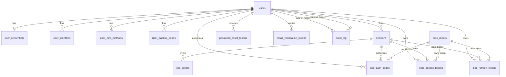

`cas_services` and `audit_log` are also present. `cas_services` is standalone. `audit_log` is one-to-many from `users` only. Every edge would clutter the diagram, so they appear in their per-table sections below.

## Conventions used everywhere

- **Primary keys**: UUID via the `uuid()` plpgsql helper (defined in 0001). Time-sortable, index-friendly. Token tables use `TEXT` PKs because the value IS the token.
- **Timestamps**: `TIMESTAMPTZ`, UTC, `DEFAULT now()`.
- **Soft deletes**: a `deleted_at TIMESTAMPTZ NULL` column where applicable. Partial indexes (`WHERE deleted_at IS NULL`) keep the hot path fast.
- **Email column**: `citext` everywhere it appears. This gives case-insensitive comparison without `lower()`.
- **`touch_updated_at` trigger**: every table with an `updated_at` column has a `BEFORE UPDATE` trigger that bumps it.
- **JSONB**: the schema uses JSONB wherever the payload shape can vary without a schema migration (audit `metadata`, federation `raw_claims`, MFA `credential`).

---

## Core identity

### `users`

The canonical user record. Everything else hangs off `users.id`.

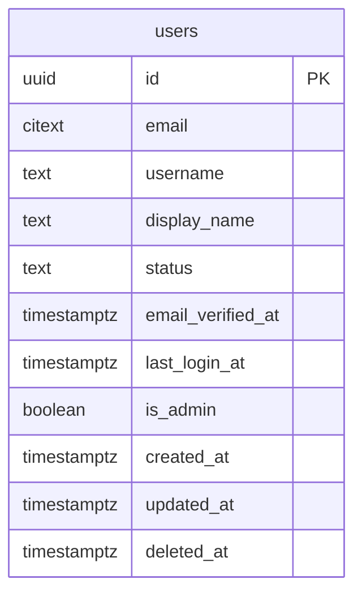

Status is one of `active`, `locked`, or `disabled`. A CHECK constraint enforces this. `email_verified_at` is `NULL` until the user clicks the verification link, or until an admin sets it manually. Migration 0007 added `is_admin`. Promotion is manual by design.

The unique indexes are partial. `(email)` and `(username)` are unique only among non-deleted rows. So you can reuse the same address after a hard delete.

### `user_credentials`

One row per user, with the argon2id password hash. It is separate from `users`, so federation-only accounts do not carry a half-populated row.

```mermaid
erDiagram
    users ||--o| user_credentials : has
    user_credentials {
        uuid user_id PK_FK
        text password_hash
        timestamptz password_changed_at
        boolean must_change
        integer failed_attempts
        timestamptz locked_until
        timestamptz created_at
        timestamptz updated_at
    }
```

`failed_attempts` and `locked_until` exist for a future brute-force lockout. Today, rate limiting is the only defence. `password_hash` is the full PHC-format string (`$argon2id$v=19$m=65536,t=3,p=4$...$...`). The parameters travel with the hash, so you can upgrade them later.

### `user_identities`

Federation links. One row per `(provider, sub)` pair. Alice's Google account is one row. Her GitHub account is another. Both point at the same `user_id`.

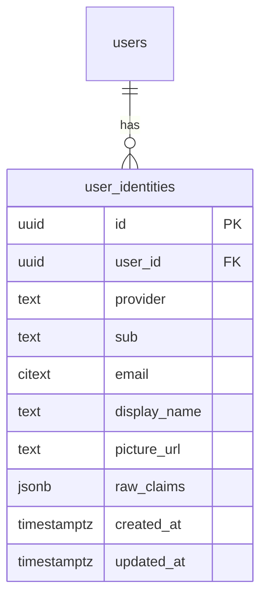

`(provider, sub)` is unique. One provider account links to exactly one IAM user. `raw_claims` is the full token payload from the last login. The server keeps it for audit and for future attribute release without a re-fetch. The `email` here is cached from the provider. It is NOT authoritative, so do not authorise against it.

### `user_mfa_methods`

Enrolled second factors. The `method` column decides which payload columns the server reads.

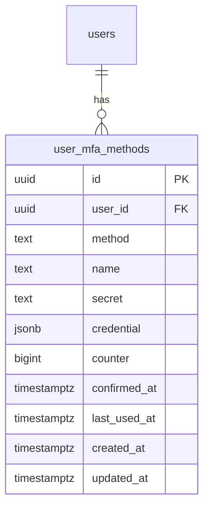

A CHECK constraint restricts `method` to `'totp'` or `'webauthn'`. For TOTP, the `secret` column holds the base32 shared secret. For WebAuthn, the `credential` JSONB holds the serialised go-webauthn credential, and `counter` tracks the FIDO sign-count for clone detection. A row is usable only after `confirmed_at` is set. Issued-but-unconfirmed enrolments stay pending.

### `user_backup_codes`

Single-use MFA recovery codes. Each row is the argon2id hash of one code. The server shows the plaintext to the user once at generation and never stores it.

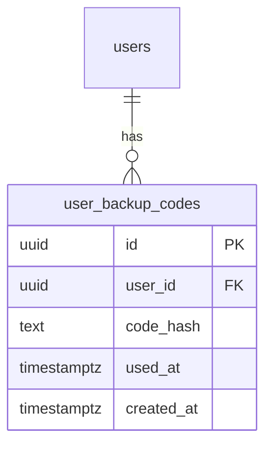

The regeneration of a user's codes is atomic. The server deletes the old set and inserts the new set in one transaction. Used codes stay in the table with `used_at` set, so the audit log can reference them.

---

## Session state

### `sessions`

Browser sessions. The session ID lives in an HMAC-signed cookie. This row holds the actual state. The session also acts as the CAS Ticket-Granting Ticket. Service tickets and OIDC tokens bind to a `session_id`.

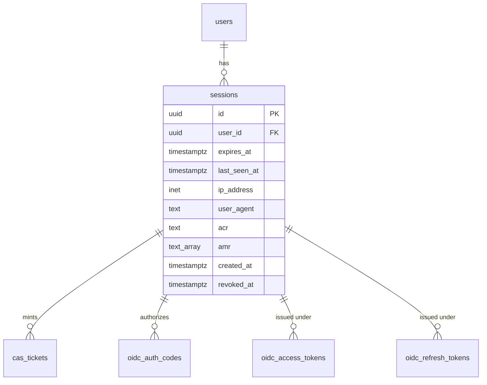

There are two expiry knobs. `expires_at` is the absolute ceiling. `last_seen_at` is the sliding anchor, bumped on every authenticated request. The `acr` and `amr` columns (added in 0006) carry the authentication context onto OIDC id_tokens. `acr='1'` means MFA was satisfied. `amr` lists the factors used.

---

## CAS

### `cas_services`

Registered CAS service URL patterns. The login flow validates the `service` query parameter against this table.

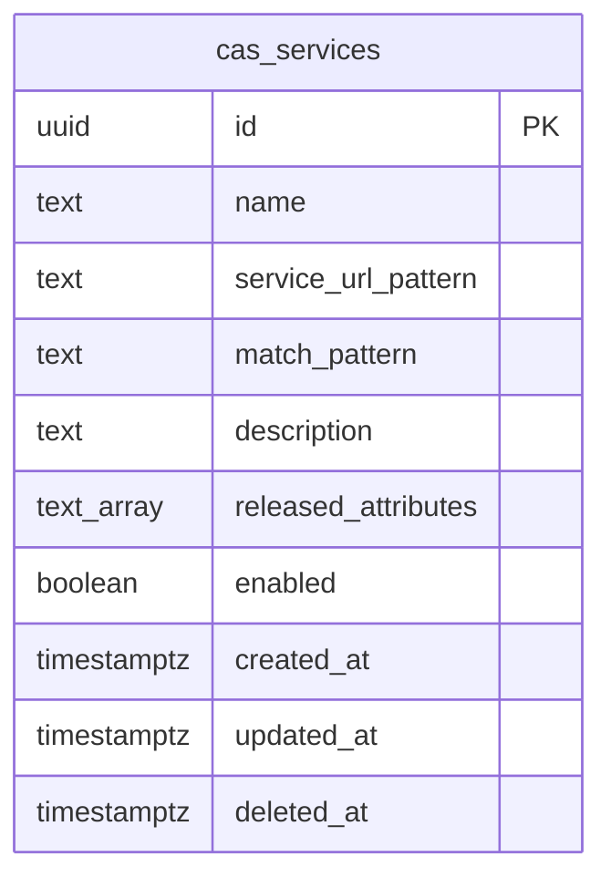

Matching uses SQL `LIKE`. The operator writes a human-readable pattern (`https://app.example.com/*`). At write time, the application stores the SQL-LIKE form (`https://app.example.com/%`) in `match_pattern`, so a lookup is a single indexed predicate. `released_attributes` controls which user fields the server releases in CAS 3.0 and SAML 1.1 validation responses. An empty value means username only.

### `cas_tickets`

Ephemeral CAS service tickets. `/cas/login` issues them and `/cas/serviceValidate` consumes them. Single-use, with a ~60-second TTL.

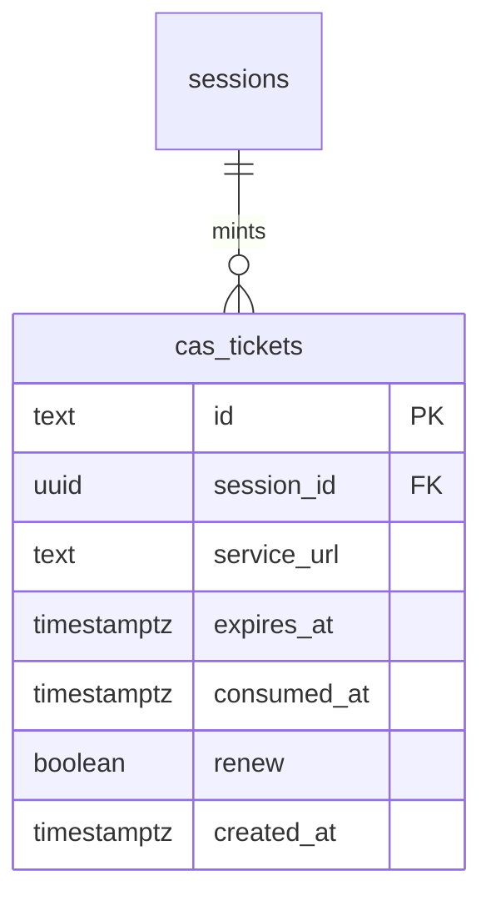

The ticket itself is the primary key. It is a server-generated random string with the `ST-` prefix that the CAS spec requires. When the relying app calls validate, the server reads the row and sets `consumed_at`. A second use returns failure. Tickets cascade-delete with sessions. So when you revoke a session, the server also removes any pending tickets.

---

## OIDC

### `oidc_clients`

Registered OAuth 2.0 / OIDC client applications.

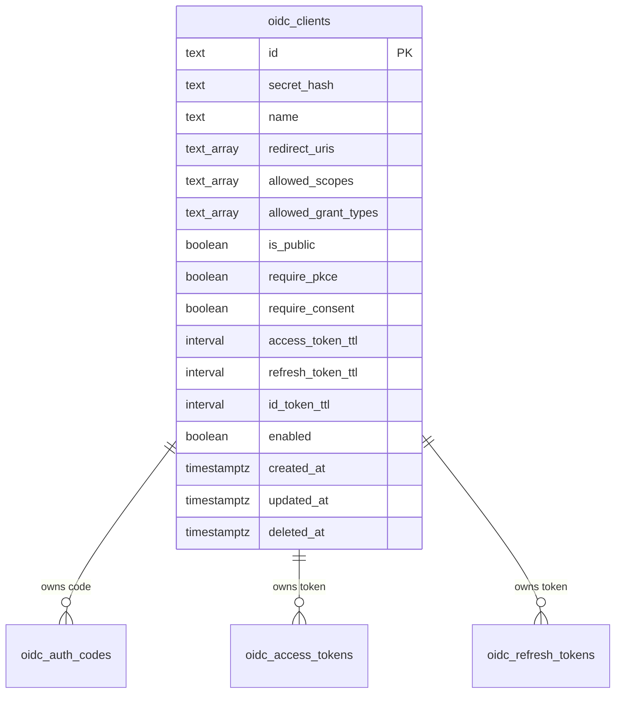

`id` is the client_id (a short string, human-friendly when possible). `secret_hash` is argon2id. It is NULL for public clients. `redirect_uris` is an exact-match allowlist. The spec does not allow wildcards. A per-client TTL overrides the server defaults. Public clients ALWAYS require PKCE, regardless of the flag.

### `oidc_auth_codes`

Short-lived authorization codes (≤10 min). The token endpoint consumes them once.

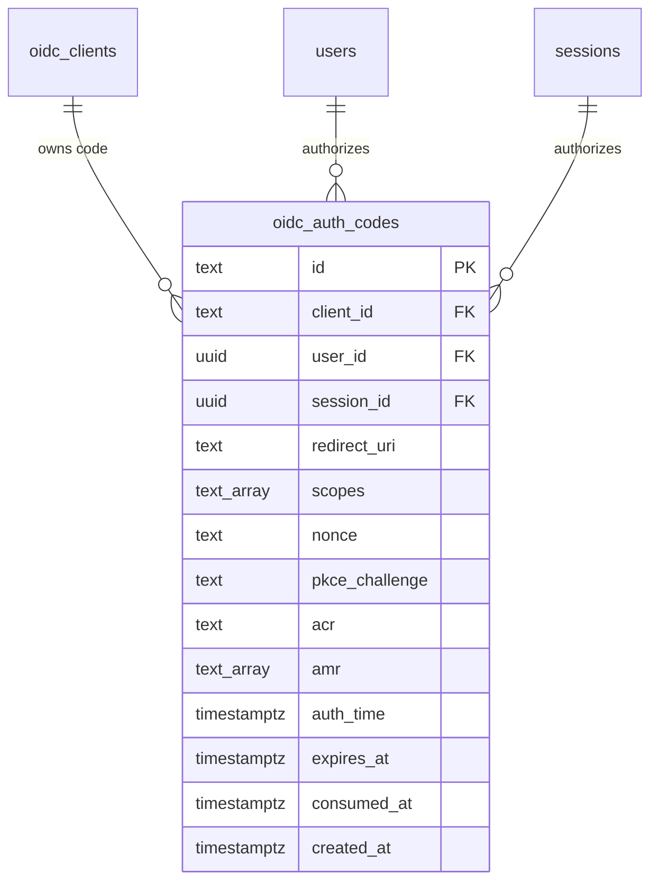

Format: `code_<32 hex chars>`. The `pkce_challenge` is the S256-hashed challenge, stored at issue time. The server checks the verifier at exchange. `acr`, `amr`, and `auth_time` capture the authentication context at issue time. So the server can reflect them back into the id_token, even if the session changed before the code exchange.

### `oidc_access_tokens`

Opaque bearer tokens. `/oauth2/introspect` and `/oauth2/userinfo` look up by token id.

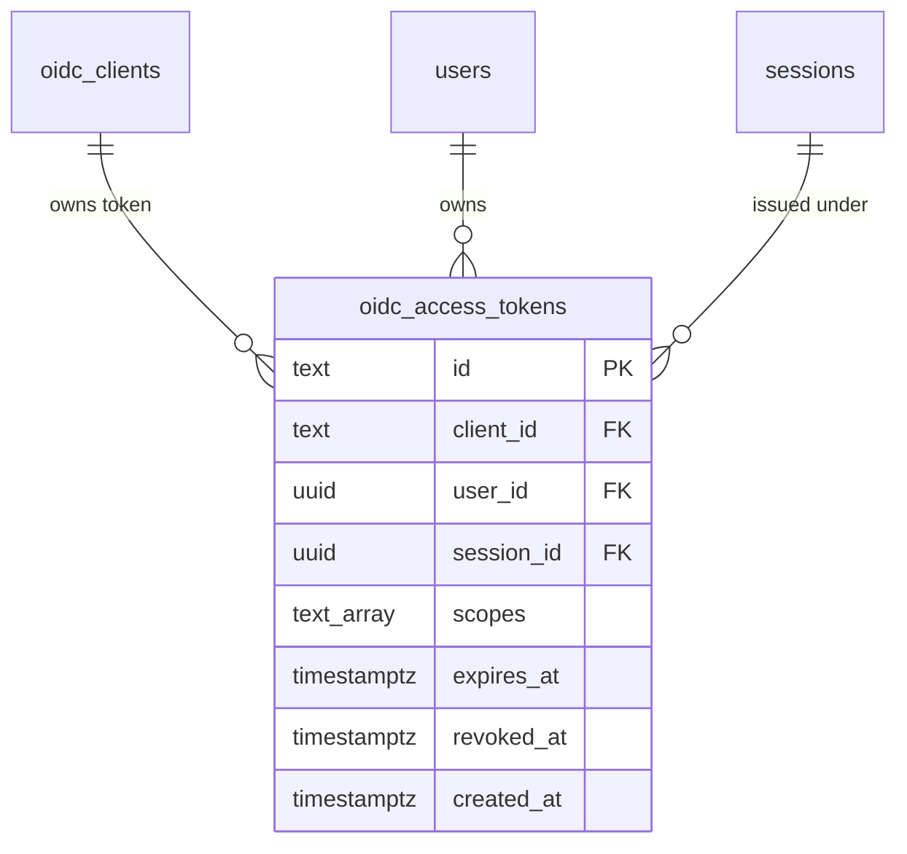

Format: `at_<32 hex chars>`. `user_id` is NULL for the client_credentials grant. There is no user, just an app that calls on its own behalf. `session_id` uses `ON DELETE SET NULL`. A session revocation does not kill outstanding access tokens. But introspection can join back to see that they are orphaned.

### `oidc_refresh_tokens`

Long-lived tokens. The client redeems them for new access tokens. Rotation chain: each use consumes the current token (sets `rotated_at`) and issues a new one whose `previous_id` points back.

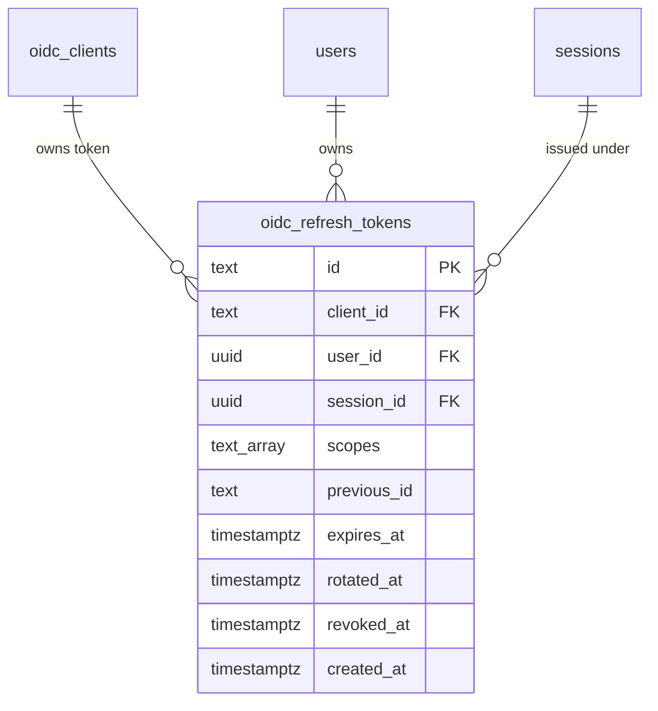

Format: `rt_<32 hex chars>`. Reuse of a rotated token (that is, `rotated_at IS NOT NULL` on lookup) means an attacker compromised the chain. The service code then revokes the entire family.

---

## Self-service flows

### `password_reset_tokens`

Forgot-password tokens. The plaintext goes to the user's inbox. The server stores only `sha256(token)`.

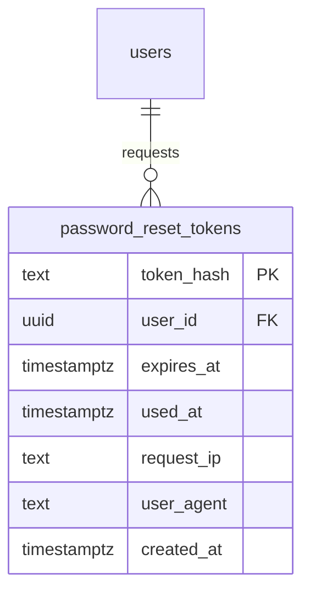

`token_hash` is the primary key. So a lookup is one indexed read on the only data the server ever sees. The default TTL is 30 minutes, enforced in the application. Single-use: the server sets `used_at` on consumption.

### `email_verification_tokens`

Signup-verification tokens. They are symmetric to password reset, with two differences. The TTL is longer (~24h). The server also snapshots the verified email at issue time.

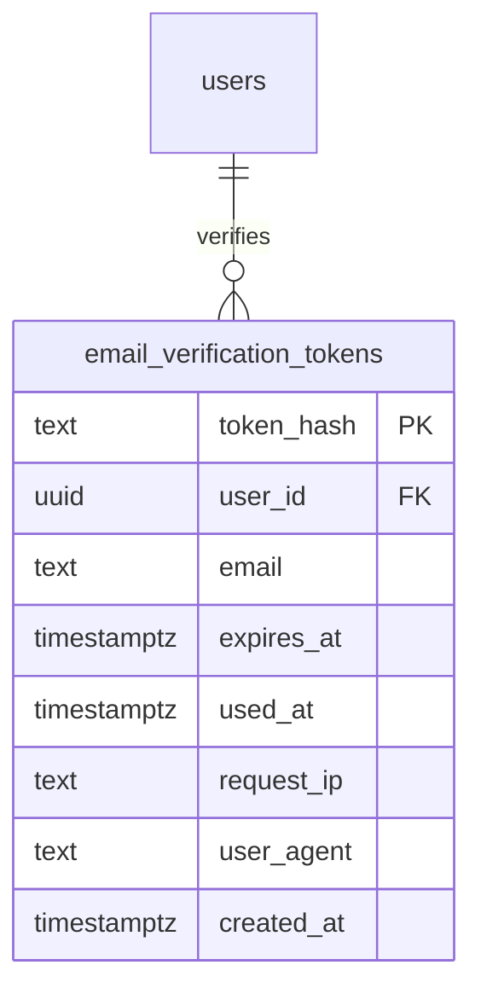

The `email` column captures the address to verify. If the user changes their email between issue and click, the token is still valid for the OLD address. The service code checks that the snapshot still matches the user's current email. Otherwise it refuses. This prevents the server from verifying a new address with a token meant for the old one.

---

## Observability

### `audit_log`

Append-only event log. Every security-relevant action gets a row.

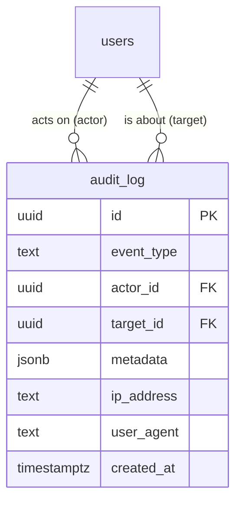

There are two user references with different meanings. `actor_id` is who CAUSED the event, either an admin or the subject. `target_id` is who the event is ABOUT. The target differs from the actor when an admin acts on someone else. Both use `ON DELETE SET NULL`, so a user deletion does not lose history. `metadata` is JSONB, so each event type can carry its own shape without a schema migration.

Event types emitted today (from `internal/audit/service.go`): `login_success`, `login_failure`, `logout`, `mfa_enrolled`, `mfa_challenge_success`, `mfa_challenge_failure`, `password_changed`, `password_reset_requested`, `password_reset_completed`, `user_created`, `user_updated`, `user_deleted`, `user_locked`, `user_unlocked`, `email_verified`, `client_created`, `client_updated`, `client_deleted`, `client_secret_rotated`, `cas_service_created`, `cas_service_updated`, `cas_service_deleted`, `federation_linked`, `federation_unlinked`, `admin_action`.

The schema tunes the indexes for the common access patterns: reverse-chronological listing, and filters by type, actor, and target.

---

## Migration order (for fresh installs)

| #    | File                                   | What it adds                                                                               |
| ---- | -------------------------------------- | ------------------------------------------------------------------------------------------ |
| 0001 | `0001_init.up.sql`                     | Extensions (`pgcrypto`, `citext`), helpers (`uuid()`, `touch_updated_at()`), `users` table |
| 0002 | `0002_credentials_and_sessions.up.sql` | `user_credentials`, `sessions`                                                             |
| 0003 | `0003_cas.up.sql`                      | `cas_services`, `cas_tickets`                                                              |
| 0004 | `0004_federation.up.sql`               | `user_identities`                                                                          |
| 0005 | `0005_oidc.up.sql`                     | `oidc_clients`, `oidc_auth_codes`, `oidc_access_tokens`, `oidc_refresh_tokens`             |
| 0006 | `0006_mfa.up.sql`                      | `user_mfa_methods`, `user_backup_codes`. Adds `acr`/`amr` to `sessions`                    |
| 0007 | `0007_admin_audit.up.sql`              | Adds `is_admin` to `users`. Creates `audit_log`                                            |
| 0008 | `0008_password_reset.up.sql`           | `password_reset_tokens`                                                                    |
| 0009 | `0009_email_verification.up.sql`       | `email_verification_tokens`                                                                |

`AUTO_MIGRATE=true` applies any pending migration on boot — fine for a single instance, but a footgun once you run more than one: a bad migration takes down every replica at once, and concurrent replicas can race applying it. For that case, set `AUTO_MIGRATE=false` and run the `/migrate` binary (built from `cmd/migrate`, shipped in the container image) as a one-shot step before rolling out the new server version. For local dev rollbacks, `make migrate-up` and `make migrate-down` (the external `golang-migrate` CLI) still work as before.
